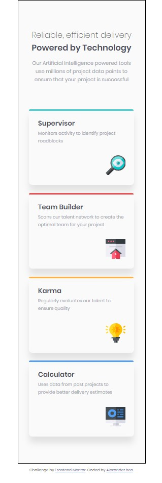
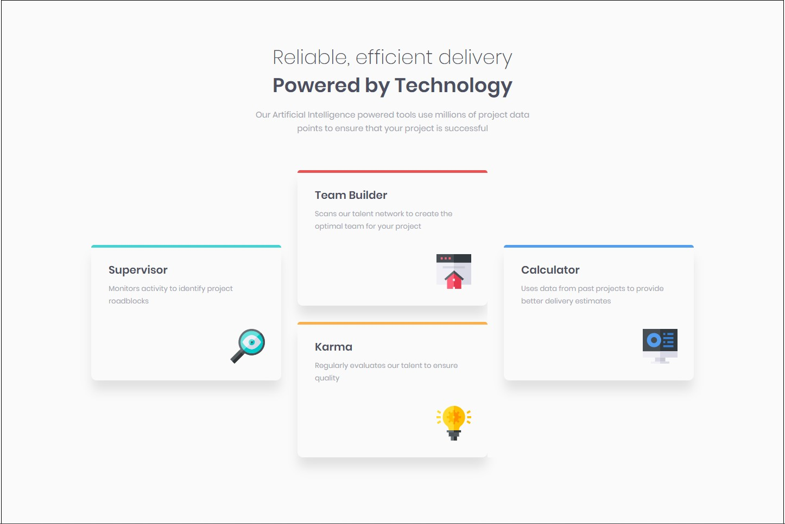

# Frontend Mentor - Four card feature section

## Welcome! 👋

Thanks for checking out my solution to Frontend Mentor's Four Card Feature Section coding challenge.   
You can see the challenge at [Frontend Masters]<https://www.frontendmentor.io/challenges/four-card-feature-section-weK1eFYK>

## The challenge by Alex Heo  
#Technologies Used  
HTML5  
CSS3  
media-queries  
keyframe animations  

## To see this project  
clone project  
open code in code editor  
launch index.html in browser  
`git clone https://github.com/AlexanderHeo/frontendmasters/four-card-section-master  
cd frontendmasters/four-card-section-master  
code .  
`
