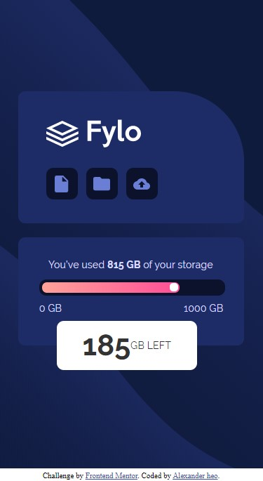
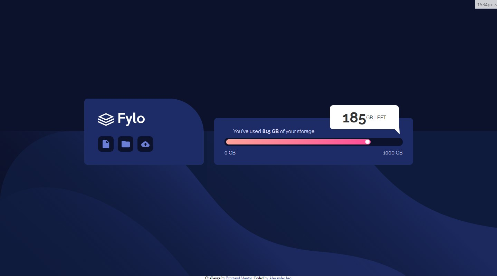

# Frontend Mentor - Fylo data storage component by Alex Heo

## Welcome! 👋

Thanks for checking out this front-end coding challenge.

[Frontend Mentor](https://www.frontendmentor.io) challenges allow you to improve your skills in a real-life workflow.

**To do this challenge, you need a basic understanding of HTML and CSS.**

## The solution

This page has been built in HTML and CSS, with media queries for

screen responsiveness. Animation has been added with CSS keyframes.

## Solution deployed

[Fylo Data Storage Component by Alex heo](https://gifted-shannon-0ec53c.netlify.app/)

## Thanks for check out my solution!
